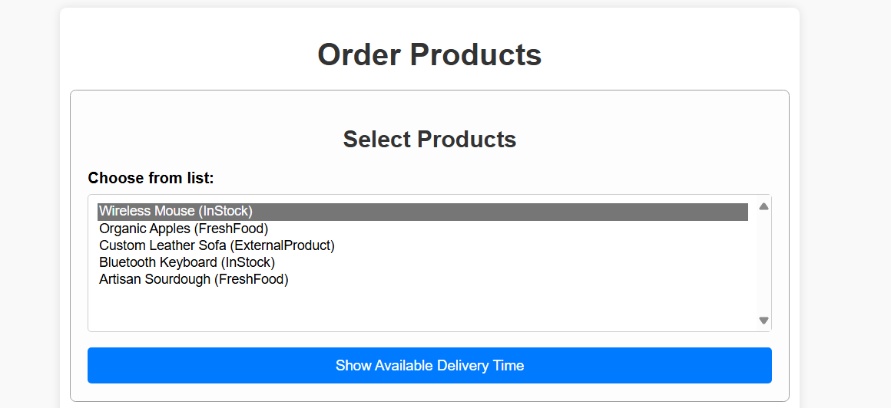
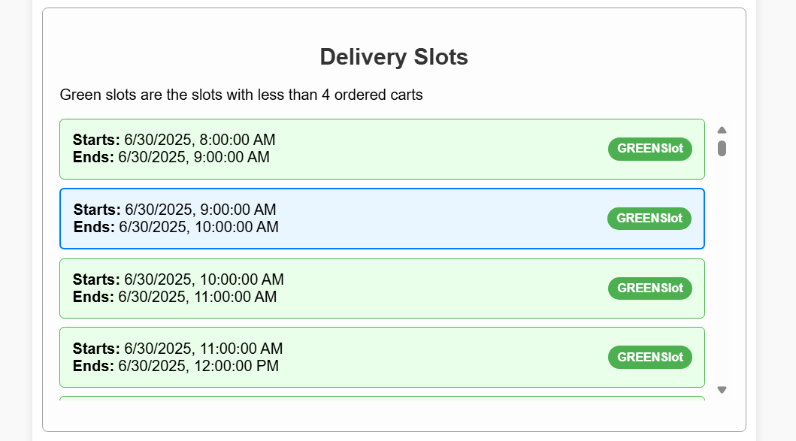
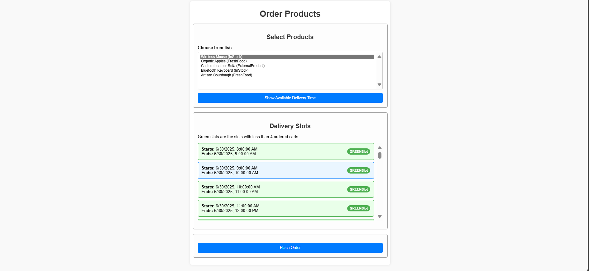
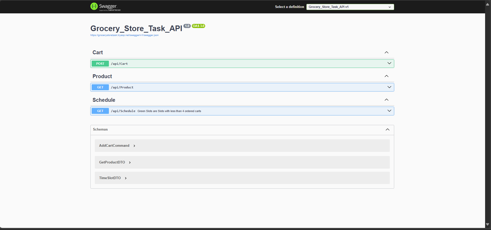

# GroceryStoreTask

A robust Grocery Store Management application built with a focus on clean architecture, modularity, and maintainability. The project leverages C# for the core logic and uses CQRS with MediatR to handle requests and business operations cleanly and efficiently.
### Live Demos
<a href="https://grocerystoretask.tryasp.net">Live Demo</a>
<br>
<a href="https://grocerystoretask.tryasp.net/swagger/index.html">API Docs</a>

## Architectural Overview

### Clean Architecture

The project strictly adopts **Clean Architecture** principles, which ensure separation of concerns and facilitate testability, scalability, and maintainability. The main layers in the `Src` folder are:

- **Domain Layer:**  
  Contains core business models and domain logic, including entities, value objects, and domain events.  
  *No dependencies on other layers.*

- **Application Layer:**  
  Houses business use cases (application services) and contract definitions.  
  Implements the **CQRS (Command Query Responsibility Segregation)** pattern, separating write (commands) and read (queries) operations.  
  Uses **MediatR** for handling commands and queries via request/response pipelines.

- **Core Layer:**  
  Contains shared logic, interfaces, and abstractions used across the application.

- **Infrastructure Layer:**  
  Implements external concerns such as data access, third-party services, and file systems.  
  Contains repositories, database context, and external service implementations.

- **API (Presentation) Layer:**  
  The entry point for the application, implementing API endpoints and controllers.

### CQRS with MediatR

- **CQRS Pattern:**  
  The application distinguishes between commands (write operations that change state) and queries (read operations that fetch data), leading to simpler and more maintainable code.
- **MediatR:**  
  Used for decoupling the request handling logic. All commands and queries are handled through MediatR pipelines, making the codebase easier to extend and maintain.

---

## Repository Folder Structure

Below is the actual and recommended structure for this repository.  
**Note:** If your structure differs, please update the directory names accordingly.

```
GroceryStoreTaskFrontend/
│   ├── index.html
│   ├── script.js
│   └── style.css
Src/
│   ├── Grocery_Store_Task_API/          # API Layer (controllers, Program.cs, etc.)
│   │     └── Controllers/
│   ├── Grocery_Store_Task_APPLICATION/  # Application Layer (CQRS, MediatR handlers, DTOs)
│   ├── Grocery_Store_Task_CORE/         # Core Layer (shared logic/interfaces)
│   ├── Grocery_Store_Task_DOMAIN/       # Domain Layer (entities, enums, exceptions)
│   ├── Grocery_Store_Task_INFRASTRUCTURE/ # Infrastructure Layer (data access, services)
```

**Main Layer Descriptions:**
- **API:** Entry point for backend, contains controllers and startup logic.
- **Application:** Use cases, CQRS handlers, MediatR pipelines, DTOs.
- **Core:** Shared interfaces, service contracts, base types.
- **Domain:** Entities, enums, and domain logic (no external dependencies).
- **Infrastructure:** Data access, repositories, service implementations.

---

## Technology Stack

- **C#** (Core logic, MediatR, Clean Architecture implementation)
- **JavaScript** (Frontend interactivity)
- **HTML/CSS** (UI/UX)
- **MediatR** (CQRS implementation)
- **Database:** (Specify here, e.g., SQL Server, SQLite)

## How It Works

1. **User requests** flow into the Presentation/API layer (controllers).
2. **Application layer** handles those requests using MediatR, separating commands and queries.
3. **Business logic** in the Domain layer is invoked as needed.
4. **Infrastructure layer** is used to persist data or interact with external services.
5. **Results** are returned back to the user through the Presentation layer.

## Getting Started

1. **Clone the repository:**
   ```bash
   git clone https://github.com/AhmedMTwab/GroceryStoreTask.git
   ```
2. **Open the solution** in Visual Studio or your preferred IDE.
3. **Restore dependencies** and configure the database connection.
4. **Build and run** the application.

## Screenshots
#Products List


#Time Slots


#Main Interface


#API Docomention


## Contribution

Contributions are welcome! Please open an issue or submit a pull request for enhancements or bug fixes.

## License

This project is licensed under the MIT License.

---
**Author:** [AhmedMTwab](https://github.com/AhmedMTwab)