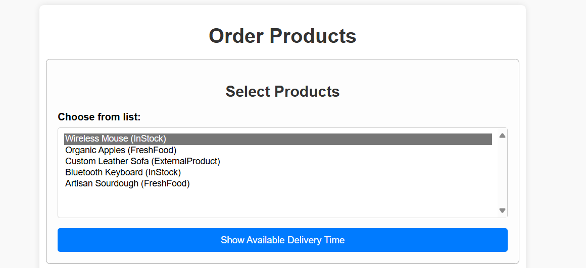
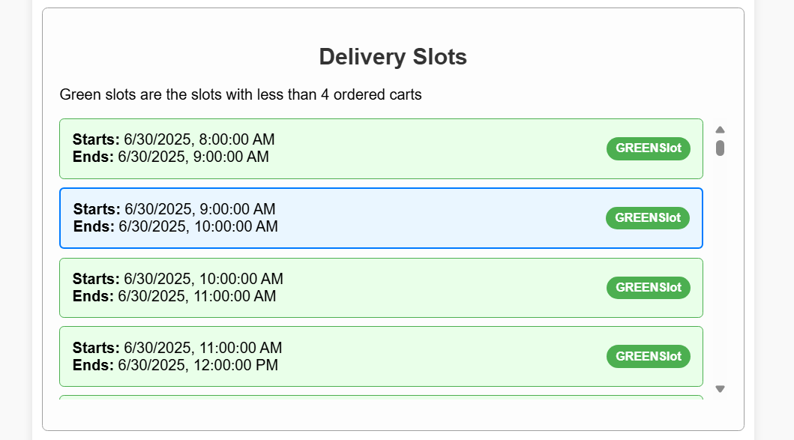
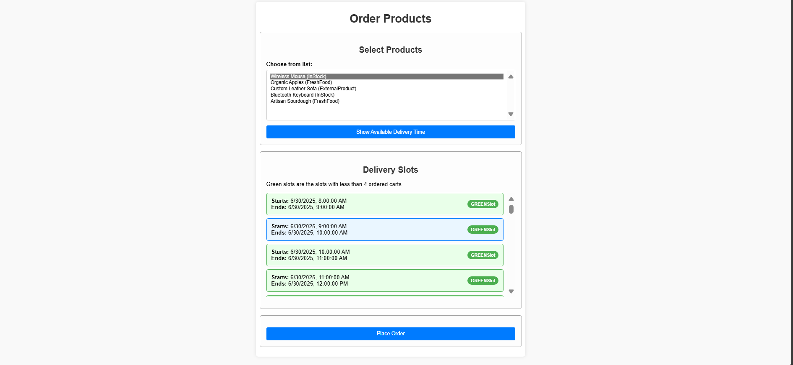
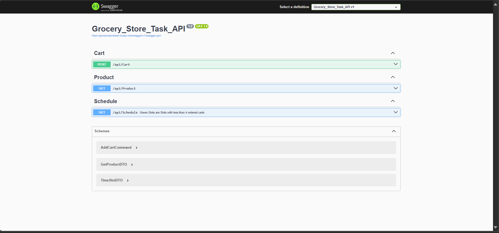

# 🛒 Grocery Store Delivery Portal

A .NET 8 Web API for managing grocery orders and delivery scheduling. The core challenge: dynamically generating available delivery time slots per product category, with hard capacity constraints enforced through domain logic — not database triggers or manual checks.

[](https://grocerystoretask.tryasp.net)
[](https://grocerystoretask.tryasp.net/swagger/index.html)
[](https://dotnet.microsoft.com/)

---

## 🚀 Features

- **Dynamic Slot Generation** — Delivery time slots are auto-generated based on each product category's allowed days and time windows — no hardcoded slots
- **Capacity Enforcement** — Slots with 4+ scheduled deliveries are automatically marked unavailable; enforced in domain logic, not the UI
- **CQRS with MediatR** — All operations flow through command/query handlers, keeping controllers thin and logic testable
- **Clean Architecture** — Domain, Application, Core, Infrastructure, and API layers fully separated
- **Unit Tested** — Application layer covered with xUnit tests
- **Vanilla JS Frontend** — Lightweight frontend included for demo purposes

---

## 🏗️ Architecture

```
Src/
├── Grocery_Store_Task_API/             # Presentation Layer — Controllers, Program.cs
├── Grocery_Store_Task_APPLICATION/     # Application Layer — CQRS Handlers, DTOs, Validators
├── Grocery_Store_Task_CORE/            # Core Layer — Shared interfaces and abstractions
├── Grocery_Store_Task_DOMAIN/          # Domain Layer — Entities, Enums, Business Rules
├── Grocery_Store_Task_INFRASTRUCTURE/  # Infrastructure Layer — EF Core, Repositories
Tests/
└── Grocery_Store_Task_APPLICATIONTests/ # xUnit tests for Application layer
GroceryStoreTaskFrontend/               # Vanilla JS/HTML/CSS demo frontend
```

**How a request flows:**
1. HTTP request hits a **Controller** (API layer)
2. Controller sends a **Command** or **Query** via MediatR
3. The appropriate **Handler** in the Application layer processes it
4. Handler calls **Domain** logic and **Repository** interfaces
5. **Infrastructure** layer executes database operations
6. Result returns back up through the layers

---

## 🧠 The Scheduling Problem

The interesting domain challenge here is slot generation. Each product category defines:
- **Allowed delivery days** (e.g., Monday, Wednesday, Friday)
- **Time windows** (e.g., 9am–12pm, 2pm–6pm)
- **Capacity limit** (max 4 deliveries per slot)

When a customer browses available slots, the system dynamically generates valid slots for the next N days based on the category's rules, then filters out any that are already at capacity. No slots are pre-stored — they're computed on demand.

---

## 🛠️ Tech Stack

| Category | Technology |
|---|---|
| Framework | ASP.NET Core Web API (.NET 8) |
| Pattern | CQRS + MediatR |
| ORM | Entity Framework Core |
| Database | SQL Server |
| Testing | xUnit |
| Frontend | Vanilla JavaScript, HTML, CSS |
| API Docs | Swagger / Swashbuckle |

---

## 📚 API Endpoints

### Products
| Method | Endpoint | Description |
|---|---|---|
| `GET` | `/api/Products` | Get all products with their categories |
| `GET` | `/api/Products/{id}` | Get product by ID |

### Delivery Slots
| Method | Endpoint | Description |
|---|---|---|
| `GET` | `/api/Slots/available/{categoryId}` | Get available slots for a product category |
| `POST` | `/api/Slots/book` | Book a delivery slot |

### Orders
| Method | Endpoint | Description |
|---|---|---|
| `POST` | `/api/Orders` | Create a new order with a booked slot |
| `GET` | `/api/Orders/{id}` | Get order details |

---

## 📸 Screenshots

### Products List


### Time Slot Selection


### Order Flow


### API Documentation


---

## 📦 Getting Started

### Prerequisites
- .NET 8 SDK
- SQL Server

### Setup

1. **Clone the repository**
   ```bash
   git clone https://github.com/AhmedMTwab/GroceryStoreTask.git
   cd GroceryStoreTask
   ```

2. **Configure the connection string** in `Src/Grocery_Store_Task_API/appsettings.json`
   ```json
   {
     "ConnectionStrings": {
       "DefaultConnection": "Server=.;Database=GroceryStoreDb;Trusted_Connection=True;"
     }
   }
   ```

   > **📌 Database Connection Note**: This application is connected to a deployed database, so you don't need to change the connection string. However, if the deployed database fails or you want to use your own database, you can update the connection string above.

3. **Apply migrations**
   ```bash
   dotnet ef database update --project Src/Grocery_Store_Task_INFRASTRUCTURE
   ```

4. **Run the API**
   ```bash
   dotnet run --project Src/Grocery_Store_Task_API
   ```

5. **Open the frontend** — open `GroceryStoreTaskFrontend/index.html` in your browser, or access Swagger at `https://localhost:5001`

### Running Tests
```bash
dotnet test Tests/Grocery_Store_Task_APPLICATIONTests
```

---

## 👤 Author

**Ahmed Mohamed Eltwab**
[](https://linkedin.com/in/ahmed-twab)
[](https://github.com/AhmedMTwab)
